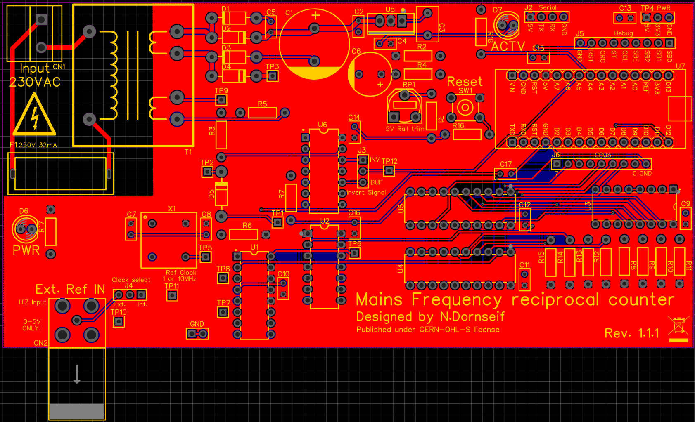

# MSM501-Mains Reciprocal Counter
Measures the frequency of mains power.  

## Overview
This device was built as an exercise in digital electronics.  
It uses a reciprocal frequency counter approach to measure the frequency of the mains voltage supplying it.   
Using two SN74LV8154N 32bit counters, it counts pulses of the mains signal and the reference clock.  
The start and end of measurement are syncronized to the input signal using a D-FlipFlop to open the main gate.  
This eliminates the influence of gate time accuracy on the measurement.  
The measurement result is then calculated as follows:  
$f_{measured} = \frac{n_{SignalCounter}}{n_{RefCounter}} \times f_{Ref}$   
The measured value is send out over serial (J2).  
Find a graph explaining the signal flow [here](Charts/Signalflow.pdf).

## Board view

## Connectors/Headers
- GND: Ground connection for scope ground clips.
- TP4: DC voltage rails.
- J2: Serial interface. Connected to D0/D1 of Arduino. (5V max.)
- J5: Debug pins. (SBUS0, SBUS1, SBUS2, SBUSE, CounterClear, GateTime, CounterRegClock, Reset)
- J6: CBUS. Used to read out the counter values.
- CN1: Mains input. Fuse with 5x20mm 32mA glass fuse in F1.
- CN2: External reference input. BNC. 0-5V square wave only. HiZ input.

## Jumpers
- JMP1 (J3): Selects if measured signal is inverted. This should not affect the measurement. Recommended setting is INV.
- JMP2 (J4): Selects external or internal reference clock. Check TP11 for selected signal.

## Test points
- TP1:  Offset voltage to compensate for the clipping diode drop. (~ 500mV DC)
- TP2:  Divided and clipped transformer output voltage. (~ 4Vp half wave rectified sine)
- TP3:  Unregulated rectified and smoothed transformer voltage. (> 17V DC)
- TP4:  DC Supply rails. (+5V and +3.3V DC)
- TP5:  Reference oscillator signal. (1MHz or 10MHz 0-5V square wave)
- TP6:  Gate-Enable signal from FlipFlop. High if main gate is open and measurement running.
- TP7:  Input to the signal counter.
- TP8:  Input to the reference counter.
- TP9:  Transformer output voltage to measurement circuit. (> 12V AC)
- TP10: External reference clock input.
- TP11: Reference input to the main gate. Should show the same signal as TP10 or TP5 depending on JMP2 (Clock select).
- TP12: Signal input to the main gate. (0-5V square wave with same frequency as mains)

## Trimmers
- RP1:  Use this pot to adjust the voltage of the 5V rail.  

## Firmware 
Find the firmware for this project in this [repository](https://github.com/ndornseif/MSM501-Firmware).  
You can just upload it using the official Arduino IDE onto the Arduino nano (U7).  
Remove the Arduino from the board when uploading firmware.  
Measurement results are in uHz and send out over serial.  
They are send as ASCII and LF, CR seperated.  
Default parameters: 115200 baud, 8 data, 1 stop, no parity

## Example data

## Considerations
Trying to power the Arduino through its USB header while the device is connected to mains is not recommended.  
Use J2 (Serial) for communication while mains is applied.

## Other
Published under CERN-OHL-S license. 